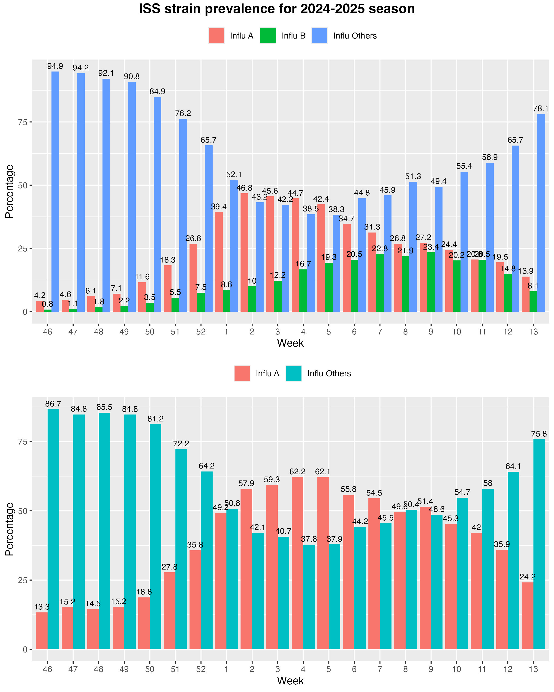

## Influcast visualizer

This repository contains code for generating and visualizing forecast plots.
All data present here are taken from the influcast.org website where different research teams upload their prediction.

Our prediction from CoMuNe Lab is shown in the left panel, highlighted in yellow.
Competing teams are displayed on the right.

This is a comparison of the past influenza seasons.

This elaborates the data from [Epicentro ISS](https://www.epicentro.iss.it/influenza/respinews#vir)
using the following aggregations

| ISS                        | Conversion | Conversion |
| :------------------------- | ---------- | ---------- |
| A/non sottotipizzati       | A          | A          |
| A(H1N1)                    | A          | A          |
| A(H3N2)                    | A          | A          |
| B                          | B          | A          |
| Virus Parainfluenzali      | Other      | A          |
| SARS-CoV2                  | Other      | Other      |
| Adenovirus                 | Other      | Other      |
| Bocavirus                  | Other      | Other      |
| Coronavirus (no SARS CoV2) | Other      | Other      |
| Metapneumovirus            | Other      | Other      |
| Rhinovirus                 | Other      | Other      |
| RSV                        | Other      | Other      |

